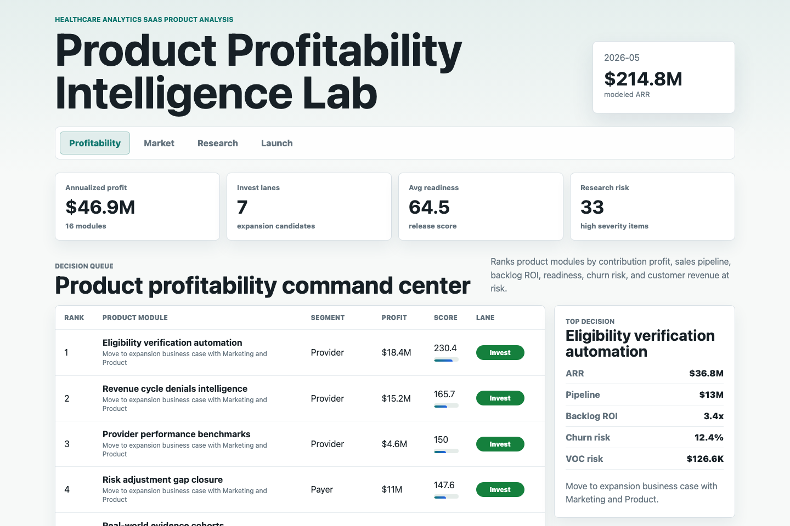
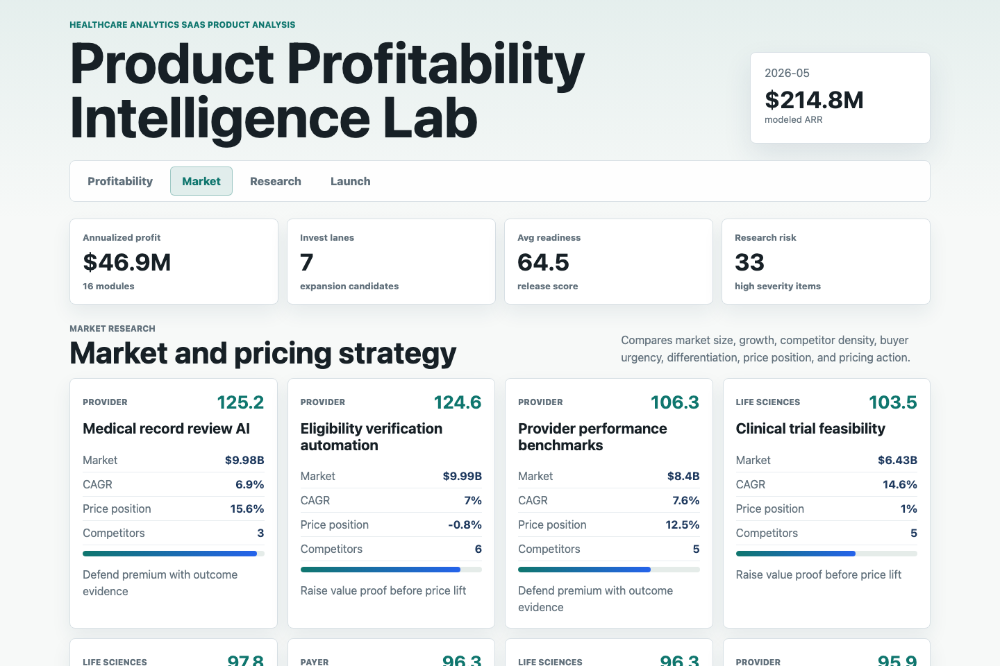
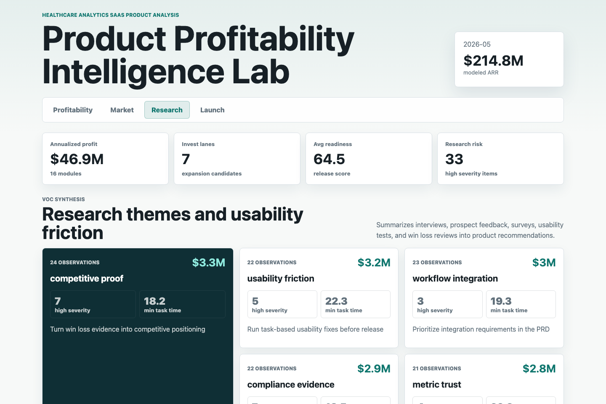

# Healthcare Product Profitability Intelligence Lab

An interactive Product Analyst portfolio artifact for a healthcare analytics SaaS team deciding which product modules to enhance, price, validate, or hold. The workbench connects product performance, market research, competitive pricing, customer feedback, roadmap economics, and HIPAA-aware release controls into one decision packet.



Caption: Product profitability command center ranking modules by modeled contribution profit, pipeline, backlog ROI, churn risk, readiness, and customer revenue at risk.



Caption: Market and pricing view comparing expansion attractiveness, competitor density, price position, buyer urgency, and packaging actions.



Caption: Customer research view showing interview themes, usability friction, high-severity feedback, modeled revenue at risk, and product recommendations.

## What This Project Demonstrates

- Product profitability analysis for healthcare analytics software modules.
- Market research synthesis, competitive pricing interpretation, and packaging recommendations.
- Voice-of-customer research using interviews, surveys, usability tests, and win loss reviews.
- Agile product documentation thinking across PRD sections, Jira epics, release readiness, and cross-functional dependencies.
- HIPAA-aware product analytics that treats privacy, access, metric lineage, and release controls as part of the product decision.

## Data

All data is deterministic synthetic data generated by `scripts/score_operating_data.py`. It does not represent real company performance, real clients, real patients, real claims, real contracts, or protected health information.

The synthetic data is modeled on common healthcare analytics SaaS structures:

- Payer workflows such as quality measurement, risk adjustment, interoperability, and value-based contract analytics.
- Provider workflows such as revenue cycle denials, eligibility verification, record review, and operational benchmarking.
- Pharmacy workflows such as adherence, claims reconciliation, medication therapy management, and prior authorization analytics.
- Life sciences workflows such as real-world evidence cohorts, clinical trial feasibility, and commercial analytics segmentation.
- Product operations artifacts such as PRD sections, Jira epics, Confluence documentation status, launch cost, revenue lift, and data quality controls.

Generated datasets include:

| File | Grain | Purpose |
|---|---|---|
| `data/product_modules.csv` | Product module | Segment, workflow, stage, owner, ARR, margin, retention, and target persona |
| `data/monthly_product_performance.csv` | Product module by month | ARR, costs, margin, transactions, churn risk, defects, pipeline, and retention |
| `data/market_competitive_signals.csv` | Product module | Market size, growth, competitor count, pricing position, and buyer urgency |
| `data/research_feedback.csv` | Research observation | Interview, survey, usability, prospect, and win loss feedback |
| `data/roadmap_prd_items.csv` | Roadmap item | Jira-style epics, PRD sections, dependencies, launch cost, and revenue lift |
| `data/data_quality_controls.csv` | Product control | HIPAA-aware privacy, access, metric lineage, refresh, and release controls |

## Analysis Outputs

| File | Purpose |
|---|---|
| `analysis/outputs/product_profitability_queue.csv` | Ranked product decision queue |
| `analysis/outputs/market_expansion_queue.csv` | Market and pricing opportunity ranking |
| `analysis/outputs/research_theme_summary.csv` | Voice-of-customer theme summary |
| `analysis/outputs/roadmap_launch_readiness.csv` | Launch readiness and roadmap economics |
| `analysis/outputs/app_payload.json` | Data powering the interactive workbench |
| `analysis/sql_checks.sql` | SQL patterns for validating portfolio, research, roadmap, and control logic |

## Role Fit

This artifact mirrors the work of a Product Analyst who must turn market research, financial forecasting, product performance, customer feedback, pricing strategy, and Agile documentation into clear recommendations for Product, Development, Marketing, and client-facing stakeholders.

## Run Locally

```bash
npm run analyze
npm start
```

Then open `http://localhost:4173`.

## Scope

This is a static portfolio artifact with reproducible synthetic data and transparent scoring. It does not connect to live healthcare systems, production analytics platforms, Jira, Confluence, billing systems, claims systems, electronic health records, client environments, or any source that contains protected health information. It shows how a Product Analyst can structure a defensible healthcare product profitability and market expansion workflow.
